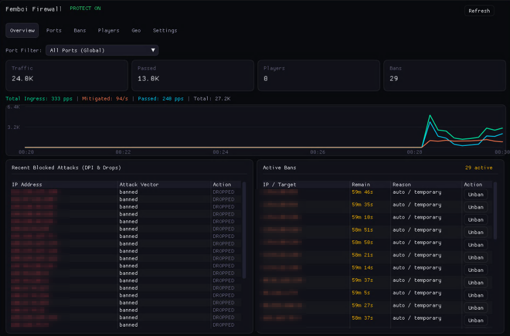
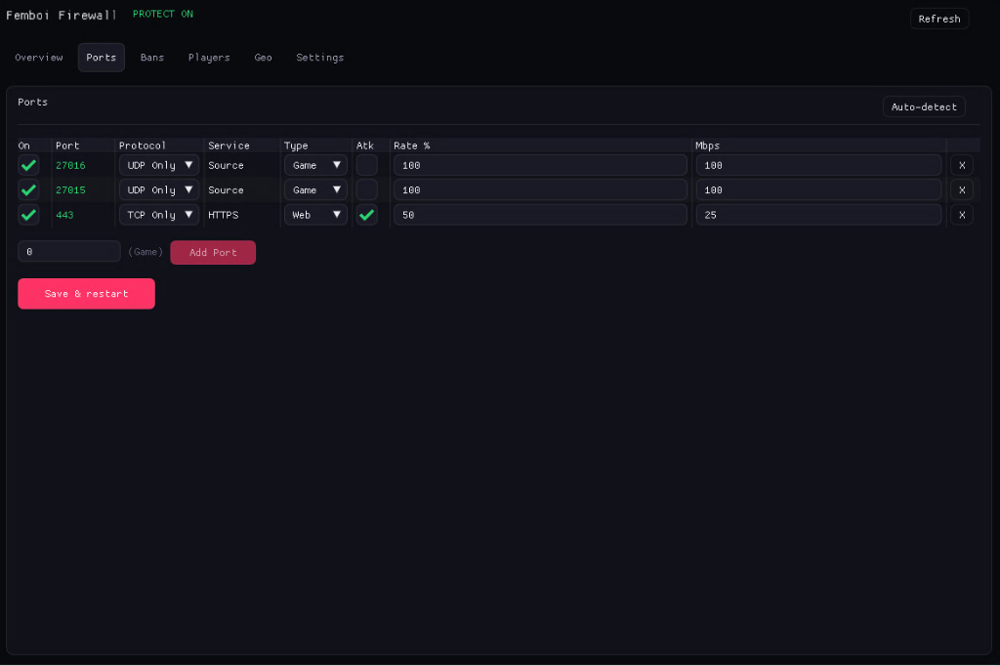
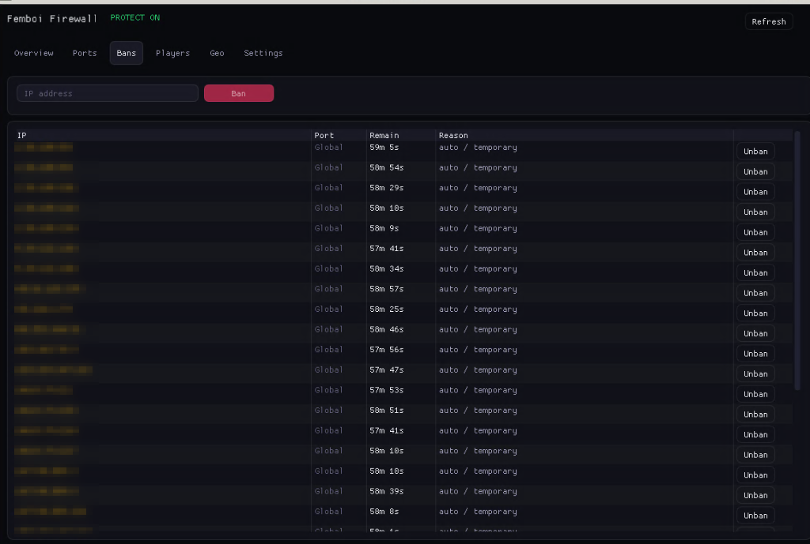
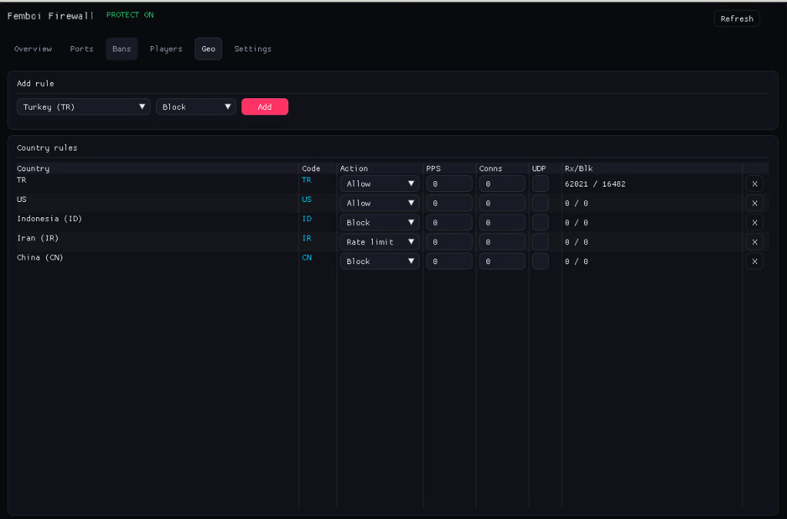
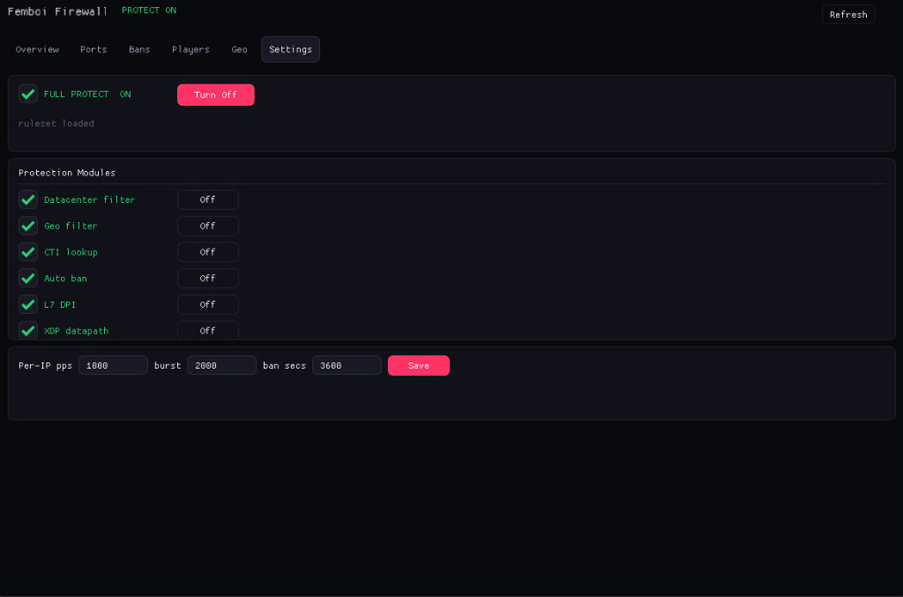

<p align="center">
  <h1 align="center">femboi-firewall</h1>
  <p align="center">
    <strong>Multi-tier DDoS mitigation engine & Dear ImGui control panel for Linux</strong>
  </p>
  <p align="center">
    <a href="https://github.com/FLUXXFALCON/femboi-firewall/blob/main/LICENSE"></a>
    
    
    
    
    
  </p>
</p>

---

### // Overview

**femboi-firewall** is an open-source, multi-layer packet filtering engine built for high-throughput Linux game servers (Source Engine, CS2, Rust) and web services.

Traffic processing is split across three execution tiers:
- **L3/L4 Wire Speed (XDP)**: Early kernel packet rejection before socket buffer (`sk_buff`) allocation.
- **Stateful Policy (nftables)**: Dynamic ban sets, GeoIP routing, datacenter ASN filters, and per-port token buckets.
- **Application L7 (nfqueue DPI)**: Deep packet inspection for Steam A2S query floods, malformed packets, and HTTP scanners.
- **Operator GUI (Dear ImGui)**: Lightweight desktop administration panel over OpenGL3/GLFW.

---

### // Interface

<div align="center">

#### ▸ Telemetry & Live Traffic
<sub>Real-time ingress, mitigation rates, and attack logs.</sub>
<br><br>


<br><br>

#### ▸ Port Quotas & Protocol Rules
<sub>Per-port bandwidth caps, protocol separation (UDP/TCP), and rate limit budgets.</sub>
<br><br>


<br><br>

#### ▸ Active Ban Sets
<sub>Dynamic blacklist decay timers and instant manual unbans.</sub>
<br><br>


<br><br>

#### ▸ GeoIP Access Policies
<sub>In-memory binary trie country filtering (`geoip.dat`).</sub>
<br><br>


<br><br>

#### ▸ Engine Settings & Modules
<sub>Runtime toggles for XDP datapath, L7 DPI, ASN filters, and burst thresholds.</sub>
<br><br>


</div>

---

### // Architecture

```
                       ┌──────────────────────────────────────────────┐
  NIC Ingress ──────►  │ Tier 1: XDP / eBPF Driver Program            │  Wire Speed
                       │ • Driver-level drop before skb allocation    │  L3 / L4
                       │ • SYN / UDP / ICMP flood mitigation          │  Zero Alloc
                       │ • Per-IP token-bucket rate limiter           │
                       └──────────────────────┬───────────────────────┘
                                              │ XDP_PASS
                       ┌──────────────────────▼───────────────────────┐
                       │ Tier 2: nftables (`inet femboifw`)           │  Kernel Policy
                       │ • Dynamic ban sets and CIDR blacklists       │  Stateful L4
                       │ • GeoIP country lookup                       │
                       │ • Per-port bandwidth / PPS quotas            │
                       └──────────────────────┬───────────────────────┘
                                              │ accept
                       ┌──────────────────────▼───────────────────────┐
                       │ Tier 3: nfqueue L7 DPI                       │  Userspace
                       │ • Source Engine (A2S) query validation       │  Application L7
                       │ • Malformed payload & exploit filtering      │
                       │ • HTTP scanner signatures                    │
                       └──────────────────────┬───────────────────────┘
                                              │ Clean Stream
                       ┌──────────────────────▼───────────────────────┐
                       │ Protected Server (srcds, cs2, nginx)         │
                       └──────────────────────────────────────────────┘
```

| Tier | Subsystem | Hook Location | Latency | Responsibility |
|:---|:---|:---|:---|:---|
| **Tier 1** | **XDP (eBPF)** | Driver RX ring | `< 1 µs` | Volumetric flood drops prior to Linux network stack allocation. |
| **Tier 2** | **nftables** | Netfilter prerouting | Low | Stateful rate limits, port budgets, ASN & country sets. |
| **Tier 3** | **nfqueue DPI** | Userspace queue | Targeted | Game protocol verification (A2S challenge enforcement) and exploit drops. |

---

### // Features

- **XDP Driver Offload**: Drops malicious packets at driver level at wire speed.
- **Source Protocol Guard**: Validates A2S_INFO and challenge responses; mitigates reflection amplification.
- **Embedded GeoIP**: In-memory binary search over 200k+ IP CIDRs (`geoip.dat`) with microsecond resolution.
- **Datacenter / ASN Filter**: Drops automated traffic from hosting and cloud IP blocks.
- **Hardware-Accelerated Panel**: Dear ImGui + GLFW desktop interface running at 60 FPS on X11 sessions.
- **Zero External Runtimes**: Pure C++20 / C. No Python, Node.js, or Java runtime dependencies on server.
- **Live Rule Reload**: Modify limits and unban addresses on-the-fly without dropping active connections.

---

### // Quick Start

#### 1. Dependencies (Debian / Ubuntu)

```bash
sudo apt update
sudo apt install -y build-essential nftables clang llvm libbpf-dev bpftool \
                    libgl1-mesa-dev libglfw3-dev libx11-dev linux-headers-$(uname -r)
```

#### 2. Build & Install Daemon

```bash
git clone https://github.com/FLUXXFALCON/femboi-firewall.git
cd femboi-firewall

chmod +x derle.sh
./derle.sh
sudo ./derle.sh --install
```

#### 3. Build Operator GUI (Optional)

```bash
make -C linux/gui
sudo cp linux/gui/fw-gui /usr/local/bin/fluxxfw-gui
```

#### 4. Service Control

```bash
# Start and enable daemon
sudo systemctl enable --now femboi-firewall

# Check status
sudo systemctl status femboi-firewall
```

---

### // Configuration

Config file location: `/etc/femboi/firewall.conf`

```ini
[firewall]
enabled=1
interface=eth0
per_ip_pps=1000
burst_pps=2000
ban_duration_secs=3600

enable_xdp=1
enable_dpi=1
enable_geoip=1
enable_datacenter_filter=1
enable_autoban=1

[ports]
27015 = udp:game:100:100
27016 = udp:game:100:100
443   = tcp:web:50:25
80    = tcp:web:50:25
```

Reload ruleset without dropping traffic:
```bash
sudo systemctl reload femboi-firewall
```

---

### // CLI Commands

```bash
# Daemon status and counters
femboi-firewall --status

# XDP eBPF map inspection
femboi-firewall-xdp stats

# View nftables ruleset
sudo nft list table inet femboifw
```

---

### // Windows Cross-Build

To cross-compile static Linux binaries from Windows:

```cmd
:: Requires zig in PATH
derle.bat
```
Output binaries are written to `bin/` (`femboi-firewall`, `femboi-firewall-xdp`).

---

### // License

MIT License. See [LICENSE](LICENSE) for details.
